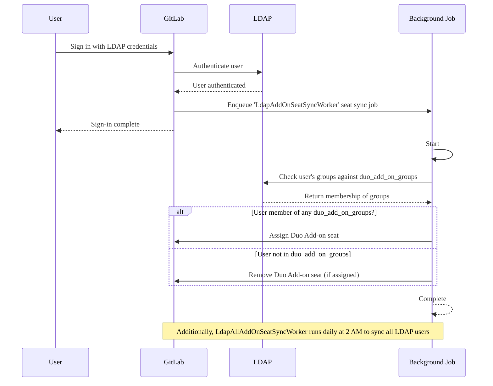



- プラン: Premium、Ultimate
- 提供形態: GitLab Self-Managed





- GitLab 17.8で[導入](https://gitlab.com/gitlab-org/gitlab/-/merge_requests/175101)されました。



GitLab管理者は、LDAPグループメンバーシップに基づいて、GitLab Duoアドオンシートの自動割り当てを設定できます。この機能を有効にすると、LDAPグループメンバーシップに応じて、ユーザーのサインイン時にGitLabはアドオンシートを自動的に割り当てまたは削除します。

## シート管理ワークフロー {#seat-management-workflow}

1. **設定**: 管理者は、`duo_add_on_groups`の[設定](#configure-gitlab-duo-add-on-seat-management)でLDAPグループを指定します。
1. **シートの同期**: GitLabは、次の2つの方法でLDAPグループメンバーシップを確認します:
   - **ユーザーサインイン時**: ユーザーがLDAP経由でサインインすると、GitLabはそのグループメンバーシップを即座にチェックします。
   - **定刻同期**: GitLabは毎日午前2:00に、すべてのLDAPユーザーを自動的に同期し、ユーザーがサインインしていなくてもシート割り当てが最新の状態に保たれるようにします。
1. **シートの割り当て**:
   - ユーザーが`duo_add_on_groups`に指定されているいずれかのグループに属している場合、（未割り当てであれば）アドオンシートが割り当てられます。
   - ユーザーがこのリストで指定されているグループに属していない場合、（割り当て済みであれば）アドオンシートが削除されます。
1. **非同期処理**: シートの割り当てと削除は非同期で処理されるため、メインのサインインフローが中断されることはありません。

次の図は、このワークフローを示しています:



## GitLab Duoアドオンシート管理を設定する {#configure-gitlab-duo-add-on-seat-management}

LDAPによるアドオンシート管理をオンにするには:

1. [インストール](auth/ldap/ldap_synchronization.md#gitlab-duo-add-on-for-groups)用に編集したGitLab設定ファイルを開きます。
1. LDAPサーバーの設定に`duo_add_on_groups`設定を追加します。
1. GitLab Duoアドオンシートを割り当てる必要があるLDAPグループ名の配列を指定します。

次の例は、Linuxパッケージインストールの場合の`gitlab.rb`設定です:

```ruby
gitlab_rails['ldap_servers'] = {
  'main' => {
    # Additional LDAP settings removed for readability
    'duo_add_on_groups' => ['duo_users', 'admins'],
  }
}
```
